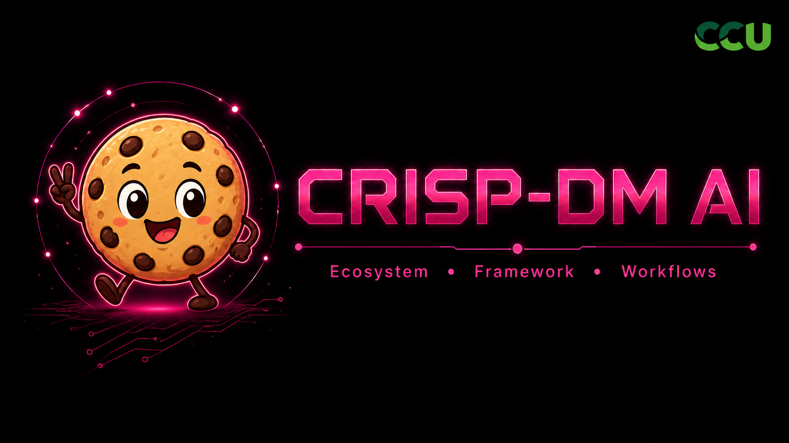

<div align="center">



<h1>CRISP-DM AI</h1>

<p><strong>CRISP-DM AI — a Gentle-AI fork that brings CRISP-DM discipline to AI-assisted Data Science and ML workflows.</strong></p>

<p>
<a href="https://github.com/Gentleman-Programming/gentle-ai/releases"></a>
<a href="LICENSE"></a>


</p>

</div>

---

## What This Fork Does

This repository is a fork of the original [Gentle-AI](https://github.com/Gentleman-Programming/gentle-ai) project. The original repository is an **ecosystem configurator** for AI coding agents: it adds persistent memory, Spec-Driven Development workflows, curated skills, MCP servers, model routing, and a teaching-oriented persona to the agents you already use.

This fork keeps that foundation and adapts it for a Data Science / ML workflow where **CRISP-DM is the visible methodology** and **SDD is the internal execution chassis**.

**Before**: "I have an AI coding agent, but my Data Science workflow still depends on loose prompts and scattered decisions."

**After**: Your agent can reason through CRISP-DM phases while keeping the SDD guarantees: artifacts, delegation boundaries, verification, persistent memory, and review safety.

### Mental Model

| Layer | Role in this fork |
| ----- | ----------------- |
| **CRISP-DM** | The domain workflow for Data Science and ML work: business understanding, data understanding, preparation, modeling, evaluation, deployment, verification, and archive. |
| **SDD** | The internal discipline layer: artifact contracts, phase boundaries, delegation, Strict TDD support, Engram memory, and review workload control. |
| **Gentle-AI** | The original installer/configurator that wires supported agents, skills, MCP servers, backups, profiles, and persona behavior. |
| **`gentle-ai-crisp`** | The demo fork binary/flavor prepared for the CRISP-DM AI experiment, with its own runtime name and config namespace. |

The important architectural decision is simple: **CRISP-DM does not replace SDD**. It sits on top of it. SDD remains the structure that keeps the AI workflow auditable instead of turning it into improvised prompting.

---

## Demo Status

The demo branch prepares the fork around three concrete pieces:

1. **A CRISP-DM AI identity** — the README and project banner now present the fork as CRISP-DM AI.
2. **A separate demo flavor** — `cmd/gentle-ai-crisp/main.go` starts the same core application as `gentle-ai`, but identifies itself as `gentle-ai-crisp` and uses the `gentle-ai-crisp` config namespace.
3. **A documented CRISP-DM + SDD plan** — the design and implementation plan live under `docs/superpowers/` and describe how native `crisp-*` phases should reuse the existing SDD architecture.

Relevant planning documents:

| Document | Purpose |
| -------- | ------- |
| [`docs/superpowers/specs/2026-05-13-sdd-crisp-profile-design.md`](docs/superpowers/specs/2026-05-13-sdd-crisp-profile-design.md) | Technical design for the SDD-CRISP native profile. |
| [`docs/superpowers/plans/2026-05-13-sdd-crisp-profile.md`](docs/superpowers/plans/2026-05-13-sdd-crisp-profile.md) | Implementation plan for CRISP phase agents, OpenCode profile overlays, tests, and demo fixture. |

---

## CRISP-DM Workflow Supported by the Fork

The CRISP-DM AI workflow is designed around these phases:

| Phase | Expected output |
| ----- | --------------- |
| **Business Understanding** | Objective, hypothesis, stakeholder, success metric, risk level. |
| **Data Understanding** | Data sources, schema, quality, permissions, PII, freshness risks. |
| **Data Preparation** | Transformations, split strategy, lineage, reproducibility, leakage checks. |
| **Modeling** | Baseline, candidate model, metrics, seeds, experiment evidence. |
| **Evaluation** | Baseline comparison, error analysis, threshold rationale, decision. |
| **Deployment** | Readiness, rollback, monitoring, drift plan, approval needs. |
| **Verify** | Audit of code, data, metrics, reproducibility, governance, and readiness. |
| **Archive** | Final decision, learnings, artifact links, and model/data cards when applicable. |

The intended agent flow is:

```txt
gentle-orchestrator
  -> detects Data Science / ML intent
  -> activates the CRISP-DM profile path
  -> delegates to crisp-* phase agents
  -> persists artifacts through Engram or OpenSpec
  -> verifies reproducibility, metrics, governance, and deployment readiness
```

The guiding rule is: **detect, respect, then recommend**. The agent should inspect the existing project conventions before proposing new tools or replacing the user's stack.

---

## Supported Agents

The fork inherits the original Gentle-AI agent support matrix.

| Agent               |         Delegation Model         | Key Feature                                                     |
| ------------------- | :------------------------------: | --------------------------------------------------------------- |
| **Claude Code**     |         Full (Task tool)         | Sub-agents, output styles                                       |
| **OpenCode**        |    Full (multi-mode overlay)     | Per-phase model routing                                         |
| **Kilo Code**       |    Full (multi-mode overlay)     | OpenCode-compatible config in `~/.config/kilo`                  |
| **Gemini CLI**      |       Full (experimental)        | Custom agents in `~/.gemini/agents/`                            |
| **Cursor**          |     Full (native subagents)      | 10 SDD agents in `~/.cursor/agents/`                            |
| **VS Code Copilot** |        Full (runSubagent)        | Parallel execution                                              |
| **Codex**           |            Solo-agent            | CLI-native, TOML config                                         |
| **Windsurf**        |            Solo-agent            | Plan Mode, Code Mode, native workflows                          |
| **Antigravity**     |   Solo-agent + Mission Control   | Built-in Browser/Terminal sub-agents                            |
| **Kimi Code**       |   Full (native custom agents)    | Modular prompt templates in `~/.kimi`                           |
| **Kiro IDE**        |     Full (native subagents)      | Native `~/.kiro/agents/` + steering orchestration               |
| **Qwen Code**       |     Full (native sub-agents)     | Slash commands, `~/.qwen/commands/`, `auto_edit` mode           |
| **OpenClaw**        |            Solo-agent            | Workspace-first `AGENTS.md` / `SOUL.md` with global MCP config  |
| **Pi**              | Full (package-managed subagents) | `gentle-pi` harness with persona/model commands + Engram memory |

> **Note**: The original Gentle-AI project supersedes [Agent Teams Lite](https://github.com/Gentleman-Programming/agent-teams-lite). This fork builds on that ecosystem instead of replacing it.

---

## Quick Start

### Recommended path for the CRISP-DM AI demo

Build the fork locally and run the isolated demo binary:

```bash
go build -o gentle-ai-crisp ./cmd/gentle-ai-crisp
./gentle-ai-crisp help
```

On Windows PowerShell:

```powershell
go build -o gentle-ai-crisp.exe ./cmd/gentle-ai-crisp
.\gentle-ai-crisp.exe help
```

Then install or sync the agent configuration through the fork binary:

```bash
./gentle-ai-crisp install
./gentle-ai-crisp sync
```

On Windows PowerShell:

```powershell
.\gentle-ai-crisp.exe install
.\gentle-ai-crisp.exe sync
```

### Original Gentle-AI install path

Use this if you want the upstream Gentle-AI CLI instead of the local CRISP-DM AI demo binary.

```bash
# macOS / Linux
brew tap Gentleman-Programming/homebrew-tap
brew install gentle-ai

# Windows
scoop bucket add gentleman https://github.com/Gentleman-Programming/scoop-bucket
scoop install gentle-ai
```

<details>
<summary><strong>Other install methods</strong> (Go install)</summary>

#### Go install (any platform with Go 1.24+)

```bash
go install github.com/gentleman-programming/gentle-ai/cmd/gentle-ai@latest
```

#### Windows

Use Scoop on Windows. It is the supported install path for keeping Gentle-AI updated cleanly:

```powershell
scoop bucket add gentleman https://github.com/Gentleman-Programming/scoop-bucket
scoop install gentle-ai
```

</details>

---

## Configure a Project for the Demo

Once the installer/sync has configured your agent, open the agent inside the target project and prepare the local context.

| Command | What it does | When to re-run |
| ------- | ------------ | -------------- |
| `/sdd-init` | Detects stack, testing capabilities, and Strict TDD support. | First time in a project, or when the test/dependency setup changes. |
| `skill-registry refresh` | Builds `.atl/skill-registry.md` so the orchestrator can inject compact project standards into subagents. | First time in a project, or after adding/removing skills or conventions. |

The SDD orchestrator can run `/sdd-init` automatically when no project context exists, but for the demo it is better to run it explicitly so the setup is visible and repeatable.

### Suggested demo prompt

Use a prompt that makes the Data Science intent explicit:

```txt
Use the CRISP-DM AI workflow to plan a small forecasting experiment.
Start with business understanding, identify the data assumptions,
define the baseline, and explain what evidence we need before deployment.
```

For the current demo branch, the CRISP-DM profile is documented as an SDD extension path. The core SDD workflow remains available through the existing `/sdd-*` commands and agent orchestration.

---

## Delegation Triggers

Gentle-AI keeps the parent/orchestrator thread thin. Once a task stops being small, delegation or an explicit SDD/CRISP phase boundary is expected rather than optional.

| Trigger                                                                    | Expected behavior                                         |
| -------------------------------------------------------------------------- | --------------------------------------------------------- |
| Reading 4+ files to understand a flow                                      | Delegate exploration or run an exploration phase.         |
| Touching 2+ non-trivial files                                              | Use one writer or require fresh review before completion. |
| Commit, push, or PR after code changes                                     | Run fresh review unless the diff is trivial docs/text.    |
| Wrong cwd, worktree/git accident, merge recovery, confusing test/env issue | Stop and run a fresh audit before continuing.             |
| Long monolithic session with accumulating complexity                       | Pause and delegate, re-plan, or justify why not.          |
| Adversarial review of diffs, conflicts, PR readiness, or incidents         | Use fresh context when the agent platform supports it.    |

The goal is not ceremony. The goal is to avoid accidental chaos while preserving one responsible orchestrator and one writer thread.

---

## Key Features You Should Know About

### OpenCode SDD Profiles

Assign different AI models to different SDD phases -- a powerful model for design, a fast one for implementation, a cheap one for exploration. OpenCode uses **`gentle-orchestrator`** as the base SDD conductor, and generated named profiles still appear as `sdd-orchestrator-{name}` entries.

```bash
# Via CLI
gentle-ai sync --profile cheap:openrouter/qwen/qwen3-30b-a3b:free
gentle-ai sync --profile-phase cheap:sdd-design:anthropic/claude-sonnet-4-20250514

# Or via TUI: gentle-ai → "OpenCode SDD Profiles" → Create
```

After creating a profile, open OpenCode and press **Tab** to switch between `gentle-orchestrator` (default) and your custom profiles.

| What you need         | Use this                                                        |
| --------------------- | --------------------------------------------------------------- |
| Default SDD conductor | `gentle-orchestrator`                                           |
| Legacy configs        | `sdd-orchestrator` is migrated to `gentle-orchestrator` on sync |
| Named model profiles  | `sdd-orchestrator-cheap`, `sdd-orchestrator-premium`, etc.      |

**Full guide**: [OpenCode SDD Profiles](docs/opencode-profiles.md)

### Engram (Persistent Memory)

Your AI agent automatically remembers decisions, bugs, and context across sessions. You don't need to do anything -- but when you do:

```bash
engram projects list          # See all projects with memory counts
engram projects consolidate   # Fix name drift ("my-app" vs "My-App")
engram search "auth bug"      # Find a past decision from the terminal
engram tui                    # Visual memory browser
```

**Full reference**: [Engram Commands](docs/engram.md)

### Backups

Every install, sync, and upgrade automatically snapshots your config files. Backups are **compressed** (tar.gz), **deduplicated** (identical configs are not re-backed up), and **auto-pruned** (keeps the 5 most recent). Pin important backups via the TUI (`p` key) to protect them from pruning.

See [Backup & Rollback Guide](docs/rollback.md) for details.

---

## Documentation

| Topic                                              | Description                                                                             |
| -------------------------------------------------- | --------------------------------------------------------------------------------------- |
| [CRISP-DM AI Design](docs/superpowers/specs/2026-05-13-sdd-crisp-profile-design.md) | Design for adapting SDD to the CRISP-DM workflow. |
| [CRISP-DM AI Implementation Plan](docs/superpowers/plans/2026-05-13-sdd-crisp-profile.md) | Planned work for native CRISP phases, prompts, profile overlays, tests, and demo fixture. |
| [Intended Usage](docs/intended-usage.md)           | How Gentle-AI is meant to be used — the mental model                                    |
| [OpenCode SDD Profiles](docs/opencode-profiles.md) | Create and manage per-phase model profiles for OpenCode                                 |
| [Engram Commands](docs/engram.md)                  | CLI commands, MCP tools, project management, team sharing                               |
| [Codebase Guide](docs/CODEBASE-GUIDE.md)           | Maintainer map for repository ownership, architecture boundaries, and review guardrails |
| [Agents](docs/agents.md)                           | Supported agents, feature matrix, config paths, and per-agent notes                     |
| [Pi Agent](docs/pi.md)                             | Pi package stack, commands, persona, model assignment, and troubleshooting              |
| [Components, Skills & Presets](docs/components.md) | All components, GGA behavior, skill catalog, and preset definitions                     |
| [Usage](docs/usage.md)                             | Persona modes, interactive TUI, CLI flags, and dependency management                    |
| [Backup & Rollback](docs/rollback.md)              | Backup retention, compression, dedup, pinning, and restore                              |
| [Kiro IDE](docs/kiro.md)                           | Kiro-specific setup, config paths, native subagents, and SDD behavior                   |
| [Platforms](docs/platforms.md)                     | Supported platforms, Windows notes, security verification, config paths                 |
| [Architecture & Development](docs/architecture.md) | Codebase layout, testing, and relationship to Gentleman.Dots                            |

---

## Community Highlights

This project gets better when the community builds on top of it.

### Community Integrations

- [sub-agent-statusline](https://github.com/Joaquinvesapa/sub-agent-statusline) — optional OpenCode TUI plugin that shows sub-agent activity, status, elapsed time, and token/context usage when OpenCode exposes it.
- [sdd-engram-plugin](https://github.com/j0k3r-dev-rgl/sdd-engram-plugin) — optional OpenCode TUI plugin to manage SDD profiles and browse Engram memories directly from OpenCode, with runtime profile activation and no restart required.

When you select OpenCode in the installer, Gentle-AI asks whether to register each community plugin and offers a browser shortcut to review the repository first. Gentle-AI only ensures `~/.config/opencode/tui.json` exists and adds the plugin package names to its `plugin` array; OpenCode installs/loads those packages the next time it starts. Once OpenCode has materialized a plugin under `~/.config/opencode/node_modules/`, `gentle-ai update` can compare its local `package.json` version with the plugin's GitHub releases.

---

## Next Steps

- **Preparing the CRISP-DM AI demo?** Build `gentle-ai-crisp`, run `install`/`sync`, then initialize the target project with `/sdd-init` and `skill-registry refresh`.
- **Extending the CRISP-DM profile?** Start with the design and implementation plan under `docs/superpowers/`.
- **Using OpenCode?** Set up [SDD Profiles](docs/opencode-profiles.md) to assign different models per phase.
- **Want to share memory across machines?** Learn `engram sync` in the [Engram reference](docs/engram.md).
- **Ready to contribute upstream?** Check [CONTRIBUTING.md](CONTRIBUTING.md) and the [open issues](https://github.com/Gentleman-Programming/gentle-ai/issues?q=is%3Aissue+is%3Aopen+label%3A%22status%3Aapproved%22).

---

## Contributors

This fork exists because the original Gentle-AI ecosystem created the foundation for agentic SDD workflows.

### CRISP-DM AI fork

- [@klagos](https://github.com/klagos) — initial fork contributor, responsible for the CRISP-DM AI direction and the implementation path for CRISP-DM workflow logic.

### Original Gentle-AI project

See [CONTRIBUTORS.md](CONTRIBUTORS.md) for the full upstream contributor list.

<a href="https://github.com/Gentleman-Programming/gentle-ai/graphs/contributors">
  
</a>

---

<div align="center">
<a href="LICENSE"></a>
</div>
